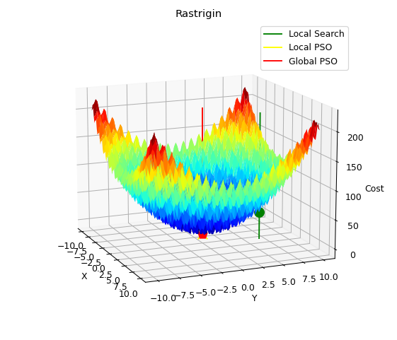
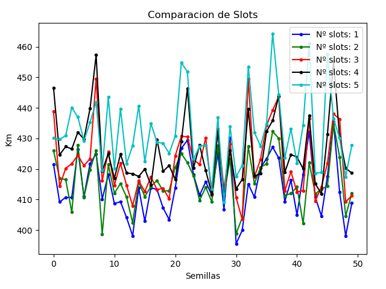
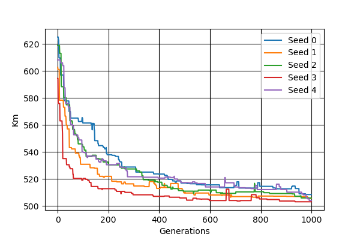
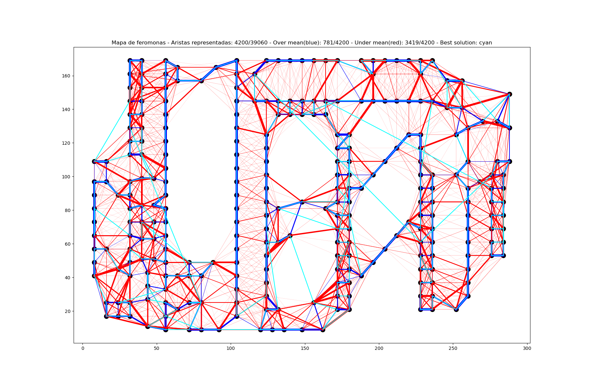

# Modelos Bioinspirados y Heuristicas de busqueda 2022
Ejercicios prácticos realizados en la asignatura de Modelos bioinspirados y heurísticas de búsqueda en 2022. El repositorio contiene las siguientes prácticas:
* Práctica 1 - Algoritmos basados en entornos y trayectorias
* Práctica 2 - Algoritmos heurísticos no contructivo (Algoritmos genéticos y búsqueda VNS)
* Práctica 3 - Algoritmos de optimización basado en colonias de hormigas
* AAD - Algoritmos de optimización basados en nube de partículas

Cada práctica tiene un fichero **.ipynb** con el cuál ejecutar cada una de ellas. Además de comentarios ampliamente detallados explicando el proceso. Asimismo, también se ha añadido una memoria explicando los resultados obtenidos. 

## Ejemplos gráficos representativos
### AAD - Comparación del algoritmo Rastrigin 

## Práctica 1 - Estudio del número de slots a emplear

## Práctica 2 - Comportamiento del algoritmo genético cuando la población es 16

## Práctica 3 - Mapa de feromonas generado por las hormigas al final de la ejecución (a280 - SHE - seed:148263551)

